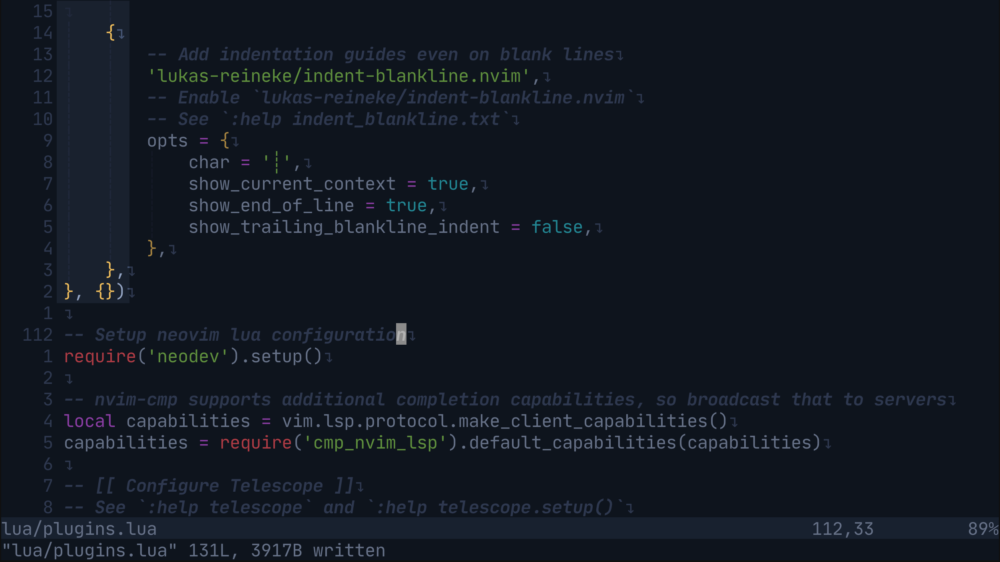
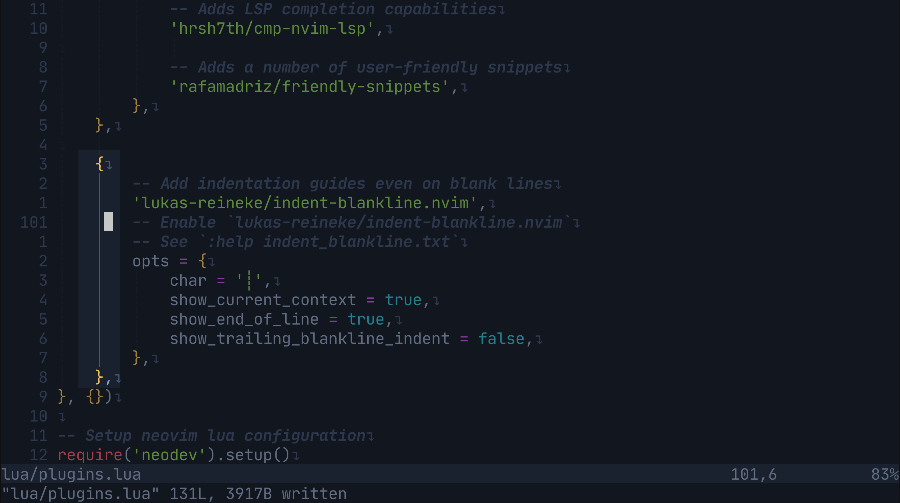
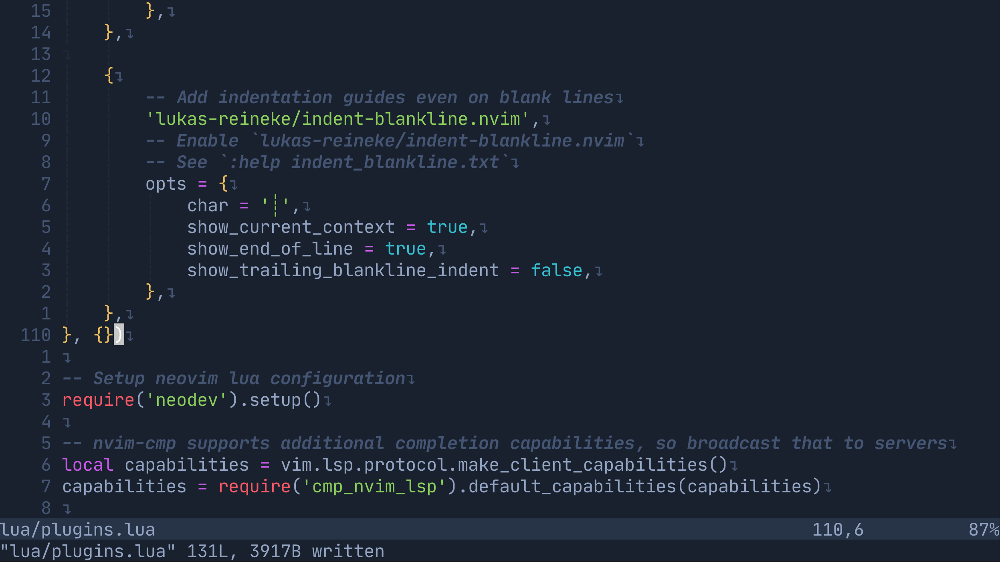

# How did I configure my neovim

## Configure `indent-blankline.nvim`
**Setup Plugin**:
https://github.com/ronthl/dotfiles/blob/fdbd320d4e723dfc4f0beb940b2321cdff40b836/.config/nvim/lua/plugins.lua#L92-L103

**Setup Options**:
https://github.com/ronthl/dotfiles/blob/fdbd320d4e723dfc4f0beb940b2321cdff40b836/.config/nvim/lua/options.lua#L29-L31

### Show indent blank line with character `┊`
https://github.com/ronthl/dotfiles/blob/fdbd320d4e723dfc4f0beb940b2321cdff40b836/.config/nvim/lua/plugins.lua#L98

### Show indent for the current context
https://github.com/ronthl/dotfiles/blob/fdbd320d4e723dfc4f0beb940b2321cdff40b836/.config/nvim/lua/plugins.lua#L99

Notice that it will highlight the current curly brackets you are staying on.

### Show the end line with the character `↴`
https://github.com/ronthl/dotfiles/blob/fdbd320d4e723dfc4f0beb940b2321cdff40b836/.config/nvim/lua/plugins.lua#L101
https://github.com/ronthl/dotfiles/blob/fdbd320d4e723dfc4f0beb940b2321cdff40b836/.config/nvim/lua/options.lua#L30-L31

## Configure `telescope.nvim`

## Configure Java Language Server Protocol

## Configure Theme

## Configure Auto-completion

## Configure `nvim-autopairs`
With the setup below, it will automatically add a paired character for us.
https://github.com/ronthl/dotfiles/blob/57169fa70cd971ab3b9e622c24b86cab54cade44/.config/nvim/lua/plugins.lua#L115-L119

## Configure `nvim-ts-autotag`
**Install plugin**:
https://github.com/ronthl/dotfiles/blob/1e2d08bb6a0c06b5e91556293b2d240e7026374e/.config/nvim/lua/plugins.lua#L121

**Initialize plugin**:
https://github.com/ronthl/dotfiles/blob/1e2d08bb6a0c06b5e91556293b2d240e7026374e/.config/nvim/lua/plugins.lua#L144-L162

**NOTE**:
* You must install `html` via `nvim-treesitter` in order to enable auto-tag feature.
Otherwise it won't work even your `autotag` is `enable`.
* By enabling `highlight`, you will have the same pair tags color.
* You must set it up outside of `lazy.nvim` setup in order to make it work.
I've tried to set it up with the `opts` option, but it doesn't work.
