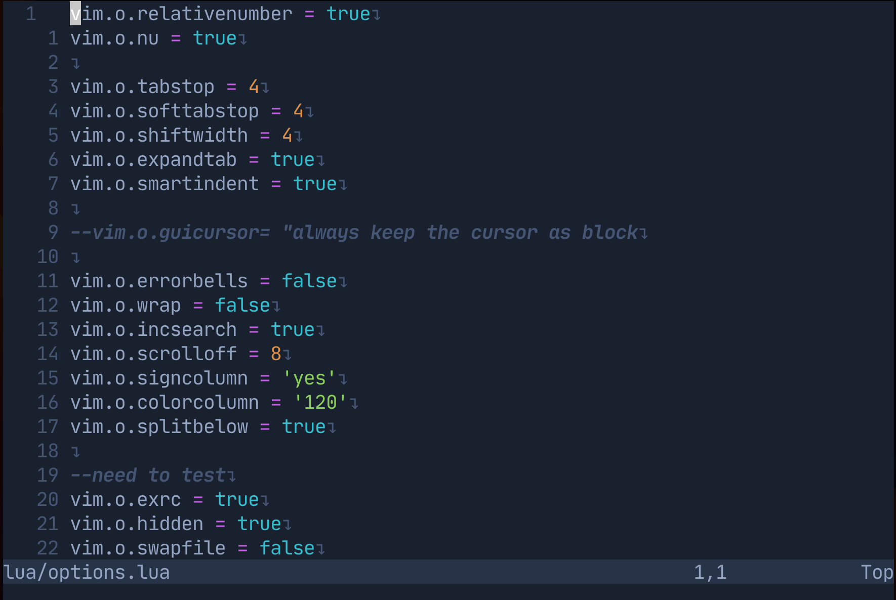

# My NeoVim 

## Install NeoVim from Source
Github repo: [neovim](https://github.com/neovim/neovim)

### Install on Debian
1. Clone source code.
2. Checkout to the `stable` tag (Optional but recommended)
```bash
git checkout tags/stable
```
3. Install build tools and dependencies
```bash
sudo apt update
sudo apt install make cmake unzip gettext -y
```
4. Build NeoVim
```bash
make CMAKE_BUILD_TYPE=RelWithDebInfo
```
5. Install NeoVim
```bash
sudo make install
```

**Result**


## Install package manager `lazy.nvim`
https://github.com/ronthl/dotfiles/blob/44543437ddd7164d99047dc3cde9b00fc5271d28/.config/nvim/lua/plugins.lua#L4-L15

## Add theme `onedark.nvim`
https://github.com/ronthl/dotfiles/blob/44543437ddd7164d99047dc3cde9b00fc5271d28/.config/nvim/lua/plugins.lua#L23-L32

**Result**


## Add `nvim-autopairs` plugin
https://github.com/ronthl/dotfiles/blob/b9e5b470f6b71d80cb27a636c3aec39759276b16/.config/nvim/lua/plugins.lua#L34-L38

**Result**


## Add `telescope.nvim` plugin
### Install plugin
https://github.com/ronthl/dotfiles/blob/0399957abca999ace7b2d3f74beba352eb20e621/.config/nvim/lua/plugins.lua#L40-L44

Call `:checkhealth telescope` after installing telescope to ensure everything is set up correctly.
As you can see in the image below, there was an error and I need to fix it in order to use `live-grep` functionality.


To fix it simply install `ripgrep`:
* On Debian:
```bash
sudo apt install ripgrep
```

Check health again to see the result.
**Note**: You don't need to fix the `WARNING` since they are optional.


### Configure `telescope.nvim`
Try the command `:Telescope find_files<cr>` to see if `telescope.nvim` is installed correctly.


### Add some `telescope` keymaps
https://github.com/ronthl/dotfiles/blob/1ace9daa5f7b34025b52837a983c9118c6532594/.config/nvim/lua/maps.lua#L3-L18

BTW, my leader key is `<space>` 😁

## Add `telescope-fzf-native.nvim` plugin
This is a `telescope.nvim` extension to improve sorting performance.

### Install plugin
https://github.com/ronthl/dotfiles/blob/2e8f3effd8a5295fc623baafaa49dff0b888002d/.config/nvim/lua/plugins.lua#L46-L52

### Load plugin
https://github.com/ronthl/dotfiles/blob/4bbc330b8a3ad449979e8ea8ae7387325d379257/.config/nvim/after/plugin/telescope.rc.lua#L1-L5

## Add `nvim-lspconfig` plugin
### Install plugin
https://github.com/ronthl/dotfiles/blob/bf37b9e82f188223eee5f2c3506b556f0c5e1457/.config/nvim/lua/plugins.lua#L54-L66

### Ensure installing LSP as your preference
https://github.com/ronthl/dotfiles/blob/f8d267e359aa2451504a3d9066604c7674733138/.config/nvim/after/plugin/lsp.rc.lua#L7-L16

### Configure and Load your LSP
The code block below is to configure LSP for Typescript and Javascript.
https://github.com/ronthl/dotfiles/blob/f8d267e359aa2451504a3d9066604c7674733138/.config/nvim/after/plugin/lsp.rc.lua#L68-L73

### Adding some key maps to interact with LSP
https://github.com/ronthl/dotfiles/blob/f8d267e359aa2451504a3d9066604c7674733138/.config/nvim/after/plugin/lsp.rc.lua#L39-L44

Take a look at the whole configuration at [lsp.rc.lua](https://github.com/ronthl/dotfiles/blob/98e70824261667c67ee621e27c9ae5355af62d64/.config/nvim/after/plugin/lsp.rc.lua).

**Result**


## Add `null-ls` plugin
[null-ls](https://github.com/jose-elias-alvarez/null-ls.nvim) is to use NeoVim as a language server to to inject LSP diagnostic,
code actions, and more via Lua.

### Install plugin
https://github.com/ronthl/dotfiles/blob/f1432f96c6dd912ff9720b181b13495d72762c9c/.config/nvim/lua/plugins.lua#L68-L71

### Configure and Load plugin
`null-ls` has a huge extensions such as `prettier`, `eslint`, etc... So you can choose any of them as your preference.
Here are my simple configuration to use `null-ls` with `prettier` extension as a formatter.
https://github.com/ronthl/dotfiles/blob/f1432f96c6dd912ff9720b181b13495d72762c9c/.config/nvim/after/plugin/null-ls.rc.lua#L31-L38

The whole configuration at [null-ls.rc.lua](https://github.com/ronthl/dotfiles/blob/e63ca9e868876dec8a7261b4a9cf588372488330/.config/nvim/after/plugin/null-ls.rc.lua#L31-L38).

**Result**


## Add `nvim-cmp` plugin
[nvim-cmp](https://github.com/hrsh7th/nvim-cmp) is a completion engine plugin for NeoVim written in Lua.
Completion sources are installed from external repositories and "sourced".

### Install plugin
https://github.com/ronthl/dotfiles/blob/c474beef5260431733ff5c30f4b75e57b03014dd/.config/nvim/lua/plugins.lua#L73-L95

### Configure and Load plugin
The whole configuration can be found at [nvim-cmp.rc.lua](https://github.com/ronthl/dotfiles/blob/da3660a7b0cbdb724af3687e4af4b51233e11c99/.config/nvim/after/plugin/nvim-cmp.rc.lua).

### Add additional completion capabilities to LSP (Optional)
https://github.com/ronthl/dotfiles/blob/c474beef5260431733ff5c30f4b75e57b03014dd/.config/nvim/after/plugin/lsp.rc.lua#L68-L72

### Autopairs when comfirm completion (Optional)
https://github.com/ronthl/dotfiles/blob/da3660a7b0cbdb724af3687e4af4b51233e11c99/.config/nvim/after/plugin/nvim-cmp.rc.lua#L7-L10
